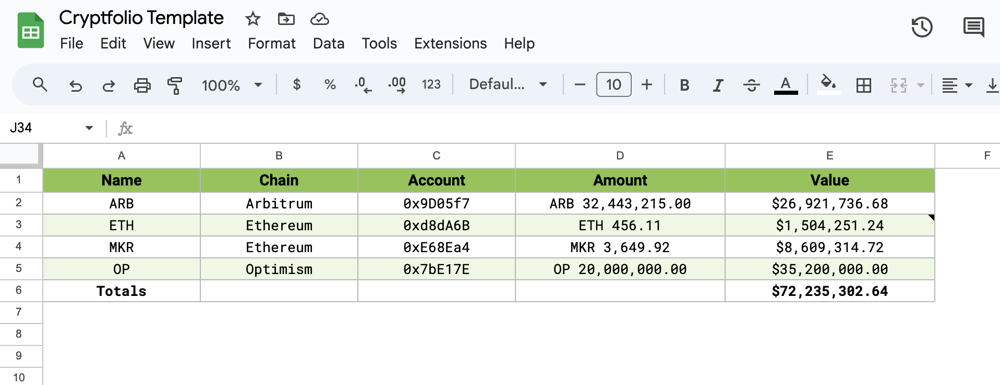
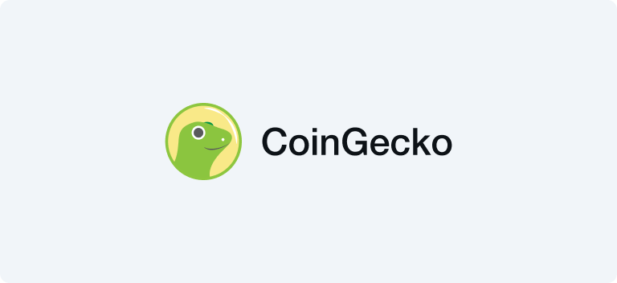

# Cryptfolio Scripts

A collection of Google Apps Script custom functions for tracking crypto portfolios in Google Sheets.

The price data is pulled using [CoinGecko's API](https://coingecko.com/en/api), and the token balances are obtained by
making queries to various RPC servers like [PublicNode](https://publicnode.com/).

_If this project helped you, consider buying me a coffee via [3Cities][3cities] or [GitHub Sponsors][sponsors]_.

## How to Use

1. Obtain a CoinGecko Demo API by following the instructions
   [here](https://support.coingecko.com/hc/en-us/articles/21880397454233-User-Guide-How-to-sign-up-for-CoinGecko-Demo-API-and-generate-an-API-key).
2. Open the [Cryptfolio template][template] in Google Sheets.
3. Click on "File", and then "Make a copy". This will create a copy of the template in Google Sheets.
4. From the toolbar, click on "Extensions", and then on "Apps Script". You should be able to see the code now.
5. Add the chains and tokens you want to track in the `ChainId` and `Token` objects in [`data.gs`](./src/data.gs).
6. Query the price data by running the `GET_ALL_PRICES` function.
7. Use the `GET_ERC20_BALANCE` and `GET_NATIVE_BALANCE` functions to query your holdings in real-time.
8. Calculate the USD value of your holdings by reading the local price data with `INDEX` and `MATCH`.

> [!NOTE]
>
> The `GET_ALL_PRICES` can only be run from within Apps Script. See the [Custom Functions](#custom-functions) section
> below.

## Template

The [template][template] shows how to query balances for ARB, ETH, MKR, and OP, and how to calculate the values of the
holdings:

## Rationale

I built this because I was frustrated with the existing solutions, which are either too complex, too expensive, or too
unstable.

Cryptfolio is:

- Free to use
- Minimalist
- DYI and easy to customize
- Functional; it just works

## Customization

This project is meant to be forked and customized to your needs. Here are two common use cases:

### Chains

To track a new chain:

- Add it to the `ChainId` object in [`data.gs`](./src/data.gs).
- Add the corresponding RPC URL to the `RpcUrl` object.
- Optionally add chain name mappings to the `ChainNameMap` object for easier reference.

### Tokens

To track a new token:

- List it in the `Data:Prices` sheet in the spreadsheet. Ensure that the `COIN_IDS` range got updated, too.
- Add the token to the `Token` object in [`data.gs`](./src/data.gs) with its contract address and decimals.
- For multi-chain tokens, use the chain-specific structure (see examples like `USDC` or `DAI`).

## Custom Functions

Here's a table with the custom functions enabled by this project.

The Read functions can be called from either Google Sheets or Apps Script, but the Write functions can only be run from
within the Apps Script environment. This is because a
[custom function](https://developers.google.com/apps-script/guides/sheets/functions?hl=en) cannot affect cells other
than those it returns a value to.

| Function             | Type  | Params                 | Description                                                        |
| -------------------- | ----- | ---------------------- | ------------------------------------------------------------------ |
| `GET_ERC20_BALANCE`  | Read  | (chain,symbol,account) | Get the ERC-20 token balance of `account` on the specified `chain` |
| `GET_NATIVE_BALANCE` | Read  | (chain,account)        | Get the native asset balance of `account` on the specified `chain` |
| `GET_ALL_PRICES`     | Write | (fiat)                 | Get the current `fiat` prices for all `COIN_IDS`                   |
| `GET_PRICE`          | Write | (coinId,fiat)          | Get the current `fiat` price for `coinId`                          |

## Contributing

Feel free to dive in! [Open](../../issues/new) an issue, [start](../../discussions/new) a discussion or submit a PR.

## CoinGecko

This project couldn't exist without the [CoinGecko API](https://coingecko.com/en/api). Thank you for providing such a
valuable service for free!

## License

This project is licensed under MIT.

[3cities]: https://3cities.xyz/#/pay?c=CAESFAKY9DMuOFdjE4Wzl2YyUFipPiSfIgICATICCAJaFURvbmF0aW9uIHRvIFBhdWwgQmVyZw
[sponsors]: https://github.com/sponsors/PaulRBerg
[template]: https://docs.google.com/spreadsheets/d/1V3uIiz5BxVd1ZBRh1s3thso5mW74tHATqcGovox2FlU/edit?usp=sharing
